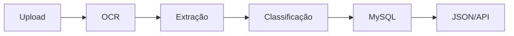

# API Extrator de Documentos 🤖

IA em Python para extrair informações de comprovantes de pagamento e boletos usando OCR.

## 🏗️ Arquitetura



## 🚀 Funcionalidades

- **OCR**: Extrai texto de PDFs e imagens
- **Dados**: Datas, valores e beneficiários
- **Categorias**: 25+ tipos automáticos
- **API REST**: 3 endpoints principais

## 🚀 Uso Rápido

### Com Docker (Recomendado)
```bash
# Iniciar com MySQL
./start-docker.sh

# Ou manualmente
docker-compose up -d
```

### Sem Docker
```bash
# Instalar
pip install -r requirements.txt
brew install tesseract tesseract-lang
cp .env.example .env

# Executar
python api.py
```

### Testar
```bash
open http://localhost:8080/docs
```

## 📡 Endpoints

- `POST /processar` - Processar documento
- `GET /documentos` - Listar documentos
- `GET /estatisticas` - Ver estatísticas

## 📊 Resposta

```json
{
  "data_vencimento": "15/01/2024",
  "valor_total": 150.50,
  "categoria": "educacao",
  "beneficiario": "Universidade XYZ"
}
```

## 🎯 Categorias (26+)

Terceiros • Educação • Treino • Delivery • Saúde • Transporte • Alimentação • Moradia • Vestuário • Lazer • Tecnologia • Serviços • Pets • Beleza • Casa • Investimentos • Trabalho • Impostos • Doação • Assinaturas • Emergência • Jurídico • Comunicação • Cultura • Esportes • Infantil

## 📁 Estrutura

```
├── api.py              # FastAPI
├── extractor.py        # OCR Logic
├── database.py         # MySQL Manager
├── docker-compose.yml  # Docker Config
├── Dockerfile         # Container Build
├── init.sql           # Database Schema
├── requirements.txt    # Dependencies
├── .env.example       # Config
├── start-docker.sh    # Quick Start
└── uploads/           # Files
```

## 🗄️ Banco de Dados

- **MySQL 8.0** via Docker
- **Tabela**: `documentos`
- **Porta**: 3306
- **Dados**: Persistidos em volume Docker
