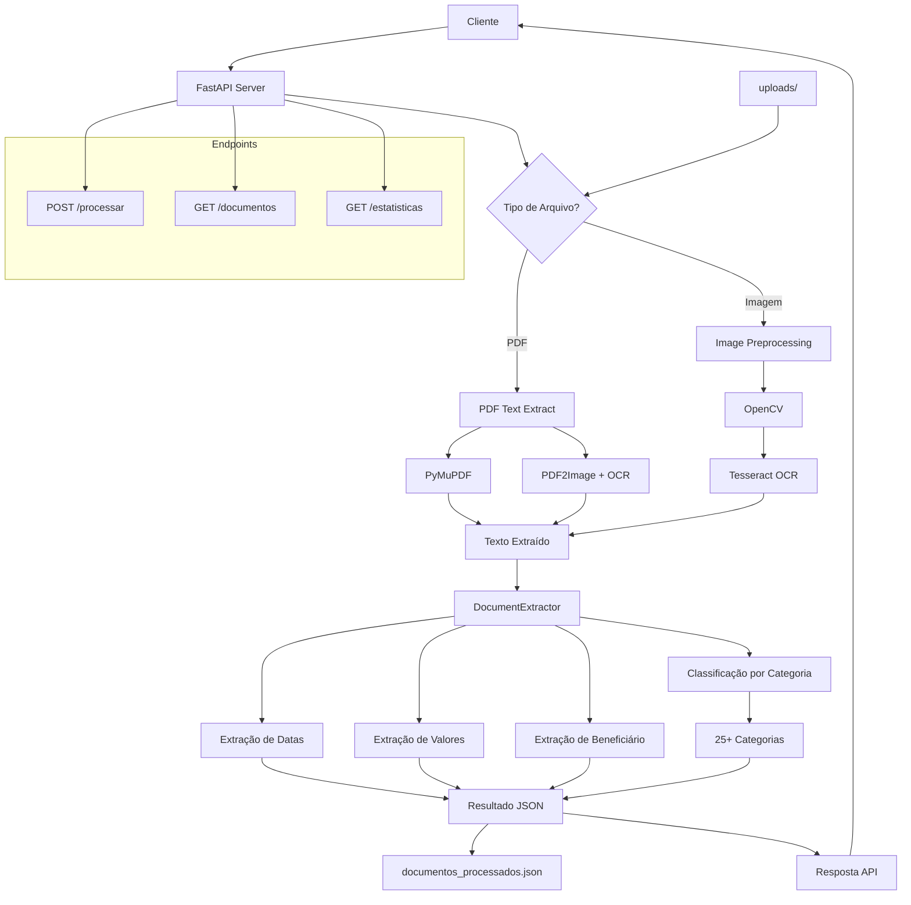

# API Extrator de Documentos 🤖

IA em Python para extrair informações de comprovantes de pagamento e boletos.

## 🏗️ Arquitetura



## 🚀 Funcionalidades

- **Extração de dados via OCR**: Data de vencimento, data de pagamento, valor total
- **Classificação automática**: Educação, treino, delivery, saúde, transporte, alimentação
- **API REST**: Endpoints para processar e consultar documentos
- **Armazenamento JSON**: Salva todas as informações extraídas

## 📋 Instalação

```bash
# Instalar dependências
pip install -r requirements.txt

# Instalar Tesseract OCR (macOS)
brew install tesseract tesseract-lang

# Ou no Ubuntu/Debian
sudo apt-get install tesseract-ocr tesseract-ocr-por
```

## 🔧 Como usar

### 1. Iniciar a API
```bash
python api.py
```

### 2. Acessar interface
- Swagger UI: http://localhost:8080/docs
- API: http://localhost:8080

### 3. Endpoints disponíveis

- `POST /processar` - Enviar documento para processamento
- `GET /documentos` - Listar todos os documentos
- `GET /documentos/{id}` - Obter documento específico
- `GET /estatisticas` - Ver estatísticas dos documentos

### 4. Testar
- Acesse http://localhost:8080/docs
- Use a interface Swagger para enviar arquivos

## 📊 Exemplo de resposta

```json
{
  "id": 1,
  "arquivo": "comprovante.jpg",
  "data_processamento": "2024-01-15T10:30:00",
  "data_vencimento": "15/01/2024",
  "data_pagamento": "14/01/2024",
  "valor_total": 150.50,
  "categoria": "educacao",
  "beneficiario": "Universidade XYZ",
  "texto_extraido": "Comprovante de pagamento..."
}
```

## 🎯 Categorias suportadas (25+ categorias)

- **Educação**: escola, universidade, curso, faculdade, pós-graduação, idiomas
- **Treino**: academia, personal, fitness, pilates, yoga, natação, boxe, dança
- **Delivery**: ifood, uber eats, rappi, james delivery, aiqfome, 99food
- **Saúde**: plano de saúde, médico, hospital, farmácia, exames, psicologia
- **Transporte**: uber, taxi, combustível, metrô, ônibus, estacionamento, IPVA
- **Alimentação**: supermercado, restaurante, padaria, bar, cafeteria, feira
- **Moradia**: aluguel, condomínio, IPTU, água, luz, gás, internet, TV cabo
- **Vestuário**: roupas, calçados, acessórios, bolsas, joias, óculos
- **Lazer**: cinema, teatro, shows, viagens, hotéis, eventos, museus
- **Tecnologia**: celular, computador, software, streaming, apps, iCloud
- **Serviços**: banco, cartão, seguros, advocacia, contabilidade, correios
- **Pets**: veterinário, pet shop, ração, vacinas, tosa, hotel para pets
- **Beleza**: salão, barbeiro, estética, cosméticos, spa, depilação
- **Casa**: móveis, decoração, eletrodomésticos, ferramentas, reforma
- **Investimentos**: corretora, ações, fundos, previdência, cripto, CDB
- **Trabalho**: material escritório, papelaria, coworking, treinamentos
- **Impostos**: IPTU, IPVA, IR, taxas, multas, DARF
- **Doação**: caridade, ONGs, igreja, dízimo, beneficência
- **Assinaturas**: mensalidades, anuidades, premium, recorrentes
- **Emergência**: hospital, ambulância, socorro, chaveiro, guincho
- **Jurídico**: advogado, processos, cartório, documentação
- **Comunicação**: telefone, internet, TV, jornal, revista
- **Cultura**: livros, arte, biblioteca, fotografia, design
- **Esportes**: futebol, tênis, corrida, bicicleta, competições
- **Infantil**: brinquedos, creche, fraldas, pediatra, escola infantil

## 📁 Estrutura do projeto

```
apiDocumento/
├── api.py              # API FastAPI
├── extractor.py        # Lógica de extração OCR
├── requirements.txt    # Dependências
├── .env               # Configurações
├── .gitignore         # Arquivos ignorados
├── start.sh           # Script para iniciar
├── uploads/           # Arquivos temporários
└── documentos_processados.json  # Banco de dados JSON
```